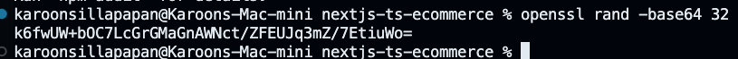
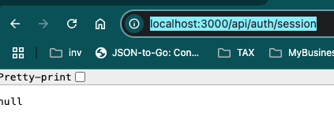
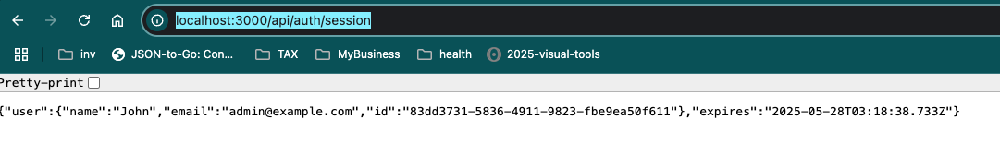
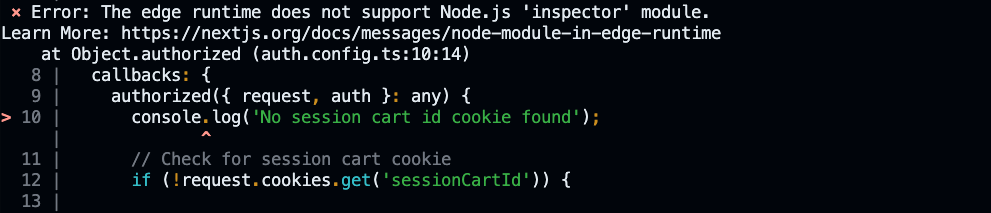

# Project

## command
```shell
npm run dev 
# http://localhost:3000
```

- Install lib
```shell
npm i lucide-react
npm i next-themes
```

## Create react project
```shell
npx create-next-app@latest nextjs-ts-ecommerce

```

### fix issue tailwind 3 to tailwind 4

- Change @apply to @reference for case error `Cannot apply unknown utility class`

```code
@layer base {
  body {
    @reference bg-background text-foreground;
  }
}

@layer base {
  * {
    @reference border-border;
  }
  body {
    @reference bg-background text-foreground;
  }
}
```

## Create Next App & Assets

## ShardCN UI Setup

- Install Shadcn and restart after install completed

```shell
npx shadcn@latest init
```
## 2:10 Root Layout & Constants


## 2:11 Header & Footer Components

```shell
npm i lucide-react
npx shadcn@latest add button
```

## 2:12 Theme Mode Toggle

```shell
npm i next-themes
npx shadcn@latest add dropdown-menu
```

## 2:13 Loading & Not Found Pages

- How to add delay for test loading

```typescript
const delay = (ms) => new Promise((resolve) => setTimeout(resolve, ms));

const Homepage = async () => {
  await delay(200);
  return <>Homepage</>;
}

export default Homepage
```

## 2:14 Responsice Sheet Menu

```shell
npx shadcn@latest add sheet
```

## 2:15 Sample Products & Product List

```shell
```

## 2:16 Product Card Component with shadcn

```shell
npx shadcn@latest add card
```

## 2:17 Product Card Component

```shell

```

## 3:19 PostgreSQL & Prisma Setup

```shell
npm i -D prisma @prisma/client
```

- Initial schema file
```shell
npx prisma init
```

## 3:20 Prisma Models & Migrations

- After config on `prisma/schema.prisma`, and then run command below

```shell
npx prisma generate

```

- Run this command for generate table on database

```shell
npx prisma migrate dev --name init
```

- Open prisma studio (http://localhost:5555)

```shell
npx prisma studio
```

## 3:21 Seed Sample Data

```shell
npx tsx ./db/seed
```
## 3:22 Load Products From database

```shell

```

## 3:23 Zod Validation & Type Interface

```shell
npm i zod
```

## Servlerless Environment Config [SKIP this process]

```shell
npm i @neondatabase/serverless @prisma/adapter-neon ws
npm i @prisma/adapter-neon@6.5.0 @prisma/client@6.5.0 prisma@6.5.0
npm i -D @types/ws bufferutil
```

- modify code `prisma/schema.prisma`

```typescript
generator client {
  provider = "prisma-client-js"
  output   = "../lib/generated/prisma"
  previewFeatures = ["driverAdapters"]  // <== Add this line
}
```

- run prisma generate again after change

```shell
npx prisma generate

```

- Add new file `db/prisma.ts`

## 3:25 Product Details Page

```shell
npx shadcn@latest add badge
```

## 3:26 Product Images component

```shell
npx shadcn@latest add badge
```

## 3:28 A Note On ES Lint Error

```shell
npm run build
```

# Section 4 : Authentication With Next Auth

## 4:30 Prisma User-Related Models

- Config model (User, Account, Session, VerificationToken)

```shell
npx prisma generate
npx prisma migrate dev --name add_user_based_tables
```

- Open prisma studio (http://localhost:5555)

```shell
npx prisma studio
```

## 4:31 Seed User Data

```shell
npx tsx ./db/seed
```

## 4:32 Next Auth Setup

- https://next-auth.js.org/

```shell
npm install next-auth@beta
npm i @auth/prisma-adapter
```

- Generate openssl rand -base64 32

```shell
openssl rand -base64 32

npm i bcrypt-ts
```



## 4:33 Next Auth Catch All API Route

- This project requie `"next-auth": "^5.0.0-beta.25",`

- You can request for test after config `http://localhost:3000/api/auth/session`



```shell

```

## 4:34 Sign in & Sign Out Action

```shell

```

## 4:35 Auth Layout & Sign in Page

```shell

```

## 4:36 Credentials Sign in Form

```shell
npx shadcn@latest add label
npx shadcn@latest add input

```

## 4:37 Hook Up Sign In Form

```shell
npx shadcn@latest add label
npx shadcn@latest add input

```

- If you sign in successfully, you can call the API at `http://localhost:3000/api/auth/session` to get the session data



## 4:38 Callback URL Redirect

- You can test with this `http://localhost:3000/sign-in?callbackUrl=http://localhost:3000/product/polo-sporting-stretch-shirt` for checking if return sucess then it redirect to `callbackUrl`

## 4:39 User Button & Sign Out

## 4:40 Sign up Zod Schema & Action

## 4:41 Sign up Page & Form

## 4:42 Sign up Error Handling

## 4:43 Customize Token With JWT Callback

## 5:45 Card Zod Schema & Prisma Modal

- After setup validators.ts and schema.prisma , you have to run command below

```shell
npx prisma generate
npx prisma migrate dev --name add_cart
```

## 5:46 Add To Cart Component

```shell
npx shadcn@latest add toast
npx shadcn@latest add sonner
```
- Implement Sonner instead of Toast.

```typescript
    // Handel successful add to cart
        // Handle success add to cart
        toast(`${item.name} added to cart ${res.message}`, {
            action: {
                label: 'Go To Cart',
                onClick: () => router.push('/cart')
            }, className: 'bg-primary text-white hover:bg-gray-800'
        });

```

- implement sonner custom.
```typescript
    // Handel successful add to cart
    toast.custom((t) => (
      <div className="bg-white shadow-md rounded-lg p-4 border border-gray-200 flex items-center space-x-4">
        <span className=" text-gray-700">{`${item.name} added to cart`}</span>
        <Button
          onClick={() => {
            router.push('/cart'); // Navigate to cart page
            toast.dismiss(t.id); // Dismiss toast after clicking
          }}
          className="ml-auto bg-blue-500 text-white px-3 py-1 rounded-md hover:bg-blue-600 transition"
        >
          Add to Cart
        </Button>
      </div>
    ));

```

- implement sonner for error and overide css

```typescript
            toast.error(res.message, {
                className: '!bg-red-500 !text-white !border !border-red-600 !shadow-sm'
            });
```

## 5:47 Session Cart ID Cookie

### Session Noted

- In this session, I need to implement a function to generate a sessionCartID at the middleware layer. When a user accesses the app, it will automatically generate a sessionCartID.

### Implement detail

- In the video, it imports `auth.ts` for use in the middleware as shown in the code below, but it doesn't work because I found an issue: `auth.ts` has many connections to third-party services, such as Prisma connecting to PostgreSQL. 

```typescript
//middleware.ts

export {auth as middleware} from '@/auth';

```

- So I decided to create `auth.config.ts` to separate the configuration from `auth.ts`, and then import it into the middleware, similar to the current code.

- I found an interesting issue: I cannot use console.log in `auth.config.ts` because it runs in the middleware layer.



## 5:48 Get Item From Cart


## 5:49 Price Calc & Add To Database

## 5:50 Handle Quantity & Multiple Product

## 5:51 Remove Cart Action

## 5:52 Dynamic Cart Button

### React State Management

### Overview

React's state management handles UI updates dynamically, allowing components to refresh specific parts of the user interface without requiring a full page reload when data changes.

### How It Works

### 1. Component State

When you use hooks like `useState()`, you're creating local component state:

```typescript
// Initialize state with a default value
const [itemCount, setItemCount] = useState(initialItem?.qty || 0);
```

### 2. State Updates

When you call state update functions (like `setItemCount()`), React:

* Updates the internal state value
* Triggers a re-render of the component
* Only updates the specific DOM elements that need to change

### 3. Reactive Rendering

Your component's JSX uses this state to determine what to display:

```jsx
<span className="px-4 font-medium">
  {itemCount || initialItem?.qty || 0}
</span>
```

When the state changes, this specific part of the UI updates.

### Real-World Example: Shopping Cart

When you click "plus" or "minus" buttons in a cart component:

* API calls happen in the background (client-side)
* React updates the displayed count without refreshing the page
* The user sees immediate visual feedback while the server action completes

### Benefits Over Traditional Websites

Unlike traditional websites where any data change required a full page reload, React's architecture provides:

* **Virtual DOM**: Creates an in-memory representation of the UI
* **Targeted Updates**: Only re-renders components affected by state changes
* **Efficient Rendering**: Minimizes browser repainting and improves performance
* **Better User Experience**: Delivers smoother interactions without page flickers

### Implementation Example

```jsx
function CartItem({ product }) {
  // Local state tracks quantity
  const [quantity, setQuantity] = useState(product.quantity);
  
  const handleIncrement = async () => {
    // Update UI immediately
    setQuantity(prev => prev + 1);
    
    // Then sync with server
    await updateCartItemQuantity(product.id, quantity + 1);
  };
  
  return (
    <div className="cart-item">
      <h3>{product.name}</h3>
      <p>${product.price}</p>
      
      <div className="quantity-controls">
        <button onClick={() => handleDecrement()}>-</button>
        <span>{quantity}</span>
        <button onClick={() => handleIncrement()}>+</button>
      </div>
    </div>
  );
}
```

### Best Practices

1. Use local state for UI elements that don't need to be shared
2. Consider context or state management libraries for shared state
3. Implement optimistic UI updates for better user experience
4. Always handle loading and error states
5. Sync client state with server after operations complete


## 5:53 Smooth UI With useTransition Hook

## 5:55 Cart Page

## 5:56 ShadCN UI Table

```shell
npx shadcn@latest add table
```


---

## NextAuth Custom Session Data Guide

### Problem

By default, NextAuth only includes a limited set of user properties (name, email, and image) in the session object. If you need to add custom properties like `id` and `role`, you need to explicitly include them.

### Solution

To add custom user data to your NextAuth session, you need to implement both the `jwt` and `session` callbacks:

```typescript
export const config = {
  // ... other NextAuth config
  callbacks: {
    async jwt({ token, user }) {
      // When a user signs in, capture their data in the token
      if (user) {
        token.id = user.id;
        token.role = user.role;
      }
      return token;
    },
    
    async session({ session, token }) {
      // Transfer data from the token to the session
      if (token) {
        session.user.id = token.id;
        session.user.role = token.role;
      }
      return session;
    },
  }
};
```

### How It Works

1. The `authorize` function in your credentials provider returns user data when credentials are verified
2. Data flows into the JWT token via the `jwt` callback when a user signs in
3. The `session` callback transfers data from the token to the session object available in your app

### Implementation Steps

1. Add the `jwt` callback to store your custom user fields in the token
2. Add the `session` callback to copy those fields to the session object
3. Access the additional data in your components using the session object

### Accessing Custom Data

After implementing these callbacks, you can access your custom data in your components:

```typescript
import { useSession } from "next-auth/react";

export default function ProfilePage() {
  const { data: session } = useSession();
  
  return (
    <div>
      <p>User ID: {session?.user.id}</p>
      <p>Role: {session?.user.role}</p>
    </div>
  );
}
```

### Important Notes

- The `jwt` callback runs when a token is created or updated
- The `session` callback runs whenever the session is checked
- Make sure your `authorize` function returns all the data you want to include in the session


